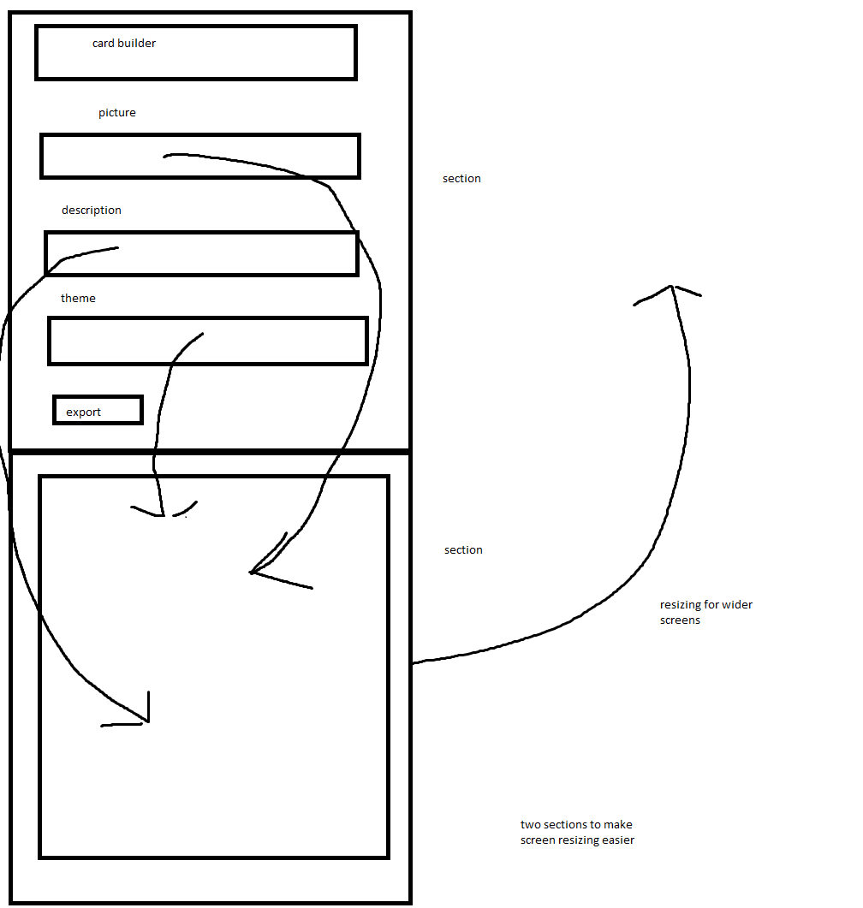

## The Golden Rule:

🦸 🦸‍♂️ `Stop starting and start finishing.` 🏁

1. Limit Work in Progress (WIP)
1. Validate each line of code before moving forward
1. Keep it Simple Simon (KISS)

## Making a plan

1. create html/css with two sections, one section containing user input, the other containing the card
2. grab each element and log it to ensure it is what I think it is
3. add event listeners for each area with user input to modifying the greeting card.
4. add export button and new script tag to html. Change the code to fit my variables.

